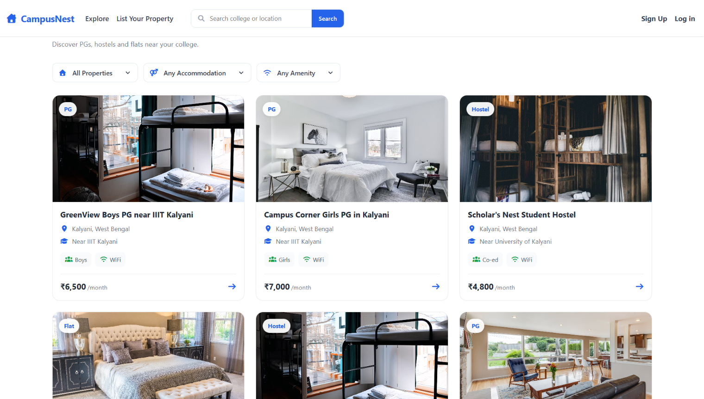
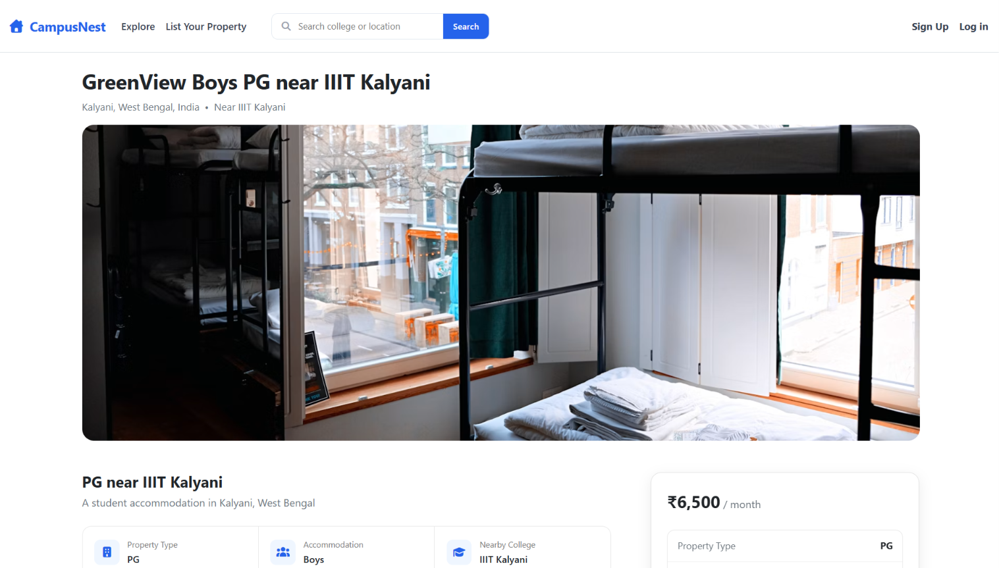
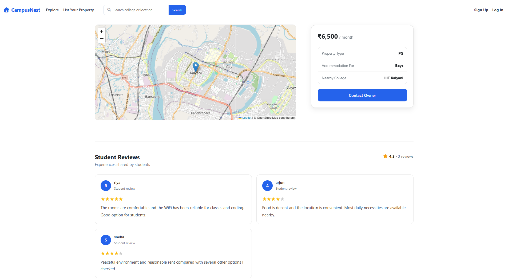
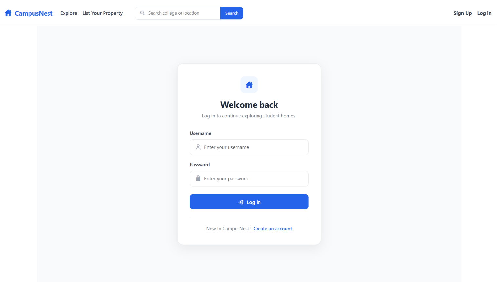

# CampusNest

CampusNest is a full-stack student accommodation platform designed to help students discover **PGs, hostels, and flats near their colleges and universities**.

The platform allows students to search and filter accommodations based on their requirements, explore property details and amenities, view locations on an interactive map, read student reviews, and manage property listings through a secure authentication system.

CampusNest was built using the **MERN stack** with a React frontend and an Express/MongoDB backend.

---

## Screenshots

### Explore Student Accommodation



### Property Details



### Location and Student Reviews



### Authentication



> Update the screenshot file names above to match the actual names inside your `screenshots` folder.

---

## Features

### Student Accommodation Discovery

Users can explore student-focused accommodation listings including:

- PGs
- Hostels
- Flats
- Boys, Girls, and Co-ed accommodations
- Properties near colleges and universities

Each listing provides important information such as monthly rent, property type, nearby college, location, amenities, description, and images.

### Search

CampusNest provides search functionality to help students quickly discover relevant accommodation based on listing information such as location and college.

### Property Filters

Students can narrow down listings based on their accommodation requirements.

Supported filters include:

- Property type
- Accommodation type
- Amenities
- Other student-housing attributes

Search and filters make it easier to find relevant properties without browsing every listing manually.

### Interactive Property Maps

Each property can be displayed on an interactive map using geographic coordinates.

Location information is converted into coordinates during listing creation/update, allowing users to understand where a property is located before considering it.

### Ratings and Reviews

Authenticated users can share their experience with a property by:

- Giving a star rating
- Writing a review
- Viewing reviews from other users
- Deleting their own reviews

Reviews are stored separately in MongoDB and connected to listings and users through Mongoose references.

### Authentication and Authorization

CampusNest includes user authentication using **Passport.js** and **passport-local-mongoose**.

Users can:

- Create an account
- Log in
- Log out
- Maintain authenticated sessions

Authorization ensures that protected operations cannot be performed by unauthorized users.

For example, only the owner of a listing can edit or delete that listing.

### Listing Management

Authenticated users can create accommodation listings containing:

- Title
- Description
- Property image
- Monthly rent
- Property type
- Accommodation type
- Nearby college/university
- Amenities
- Location
- Country

Listing owners can later edit or delete their properties.

### Image Uploads

Property images are uploaded using **Cloudinary** rather than being stored directly in the application database.

The application uses Multer with Cloudinary storage for handling image uploads.

### Responsive Interface

CampusNest has been designed to work across desktop and mobile screen sizes.

The interface includes:

- Responsive property cards
- Mobile navigation
- Responsive forms
- Responsive property pages
- Sticky property information/rent section on larger screens
- Mobile-friendly search and filtering

---

## Tech Stack

### Frontend

- React.js
- React Router
- Axios
- Bootstrap
- CSS
- Font Awesome
- React Hot Toast
- React Simple Star Rating

### Backend

- Node.js
- Express.js
- REST APIs

### Database

- MongoDB
- Mongoose

### Authentication

- Passport.js
- Passport Local
- Passport Local Mongoose
- Express Session

### Image Storage

- Cloudinary
- Multer
- Multer Storage Cloudinary

### Maps and Geolocation

- OpenStreetMap
- Nominatim Geocoding
- Leaflet / React Leaflet

---

## Application Architecture

CampusNest follows a client-server architecture:

```text
React Frontend
      |
      | Axios HTTP Requests
      v
Express REST API
      |
      | Mongoose
      v
MongoDB
```

External services are used for additional functionality:

```text
CampusNest
│
├── React Frontend
│
├── Express Backend
│
├── MongoDB
│
├── Cloudinary
│     └── Property Images
│
└── OpenStreetMap / Nominatim
      └── Maps and Geocoding
```

---

## Database Relationships

CampusNest uses referenced MongoDB documents to represent relationships between users, listings, and reviews.

```text
User
 │
 │ owns
 v
Listing
 │
 │ contains review references
 v
Review
 │
 │ written by
 v
User
```

A listing stores references to its reviews:

```js
reviews: [
    {
        type: Schema.Types.ObjectId,
        ref: "Review"
    }
]
```

A review stores a reference to its author:

```js
author: {
    type: Schema.Types.ObjectId,
    ref: "User"
}
```

Listings similarly maintain ownership information through a User reference.

---

## Project Structure

```text
CampusNest/
│
├── Frontend/
│   ├── src/
│   │   ├── components/
│   │   ├── context/
│   │   ├── hooks/
│   │   ├── pages/
│   │   └── App.jsx
│   │
│   └── package.json
│
├── Backend/
│   ├── Controllers/
│   ├── Models/
│   ├── Routes/
│   ├── init/
│   │   ├── data.js
│   │   └── index.js
│   ├── utils/
│   ├── cloudConfig.js
│   ├── schema.js
│   ├── app.js
│   └── package.json
│
├── screenshots/
│
└── README.md
```

> The exact folder names can be adjusted if your repository structure differs slightly.

---

## API Overview

The backend exposes RESTful routes for listings, reviews, and authentication.

### Listings

```text
GET     /listings
GET     /listings/:id
POST    /listings
PUT     /listings/:id
DELETE  /listings/:id
```

### Reviews

```text
POST    /listings/:id/reviews
DELETE  /listings/:id/reviews/:reviewId
```

### Authentication

```text
POST    /signup
POST    /login
GET     /logout
```

Protected routes require an authenticated session.

---

## Running CampusNest Locally

### 1. Clone the repository

```bash
git clone <your-repository-url>
cd CampusNest
```

### 2. Install backend dependencies

```bash
cd Backend
npm install
```

### 3. Install frontend dependencies

Open another terminal:

```bash
cd Frontend
npm install
```

### 4. Configure environment variables

Create a `.env` file inside the backend directory.

```env
CLOUD_NAME=your_cloudinary_cloud_name
CLOUD_API_KEY=your_cloudinary_api_key
CLOUD_API_SECRET=your_cloudinary_api_secret

SESSION_SECRET=your_session_secret

MONGO_URL=your_mongodb_connection_string
```

Use the environment-variable names that match your actual project configuration.

Never commit the `.env` file to GitHub.

Make sure `.gitignore` contains:

```gitignore
.env
node_modules/
```

### 5. Start MongoDB

If using MongoDB locally, make sure your MongoDB service is running.

The development database can use:

```text
mongodb://127.0.0.1:27017/CampusNest
```

### 6. Seed the database

CampusNest contains realistic demo student accommodation data for development and testing.

From the backend directory:

```bash
node init/index.js
```

The seed script creates:

- Student accommodation listings
- Demo users
- Property reviews
- Relationships between listings, reviews, owners, and review authors

The accounts created by the seed script are demo accounts only and do not contain real user credentials.

### 7. Start the backend

```bash
node app.js
```

Or, if Nodemon is configured:

```bash
nodemon app.js
```

The backend runs on:

```text
http://localhost:8080
```

### 8. Start the frontend

From the frontend directory:

```bash
npm run dev
```

Vite will start the React development server.

Open the local URL shown in the terminal.

---

## Security

CampusNest follows several basic security practices:

- Passwords are handled through Passport Local Mongoose rather than being stored as plain-text passwords.
- Authentication is maintained using server-side sessions.
- Protected backend routes verify authentication.
- Listing modification is restricted to listing owners.
- Review deletion is restricted to the review author.
- Environment variables are used for application secrets and external service credentials.
- Uploaded files are handled through controlled image-upload middleware.
- Server-side validation is performed before accepting listing and review data.

---

## Validation and Error Handling

CampusNest uses validation on both the frontend and backend.

### Client Side

Bootstrap validation provides immediate feedback while users fill out forms.

### Server Side

Joi schemas validate incoming listing and review data before database operations are performed.

This is important because client-side validation alone can be bypassed.

The backend also uses centralized error handling to return appropriate responses to the frontend.

---

## Seed Data

The project includes realistic development seed data designed around Indian colleges and student accommodation.

Instead of generic vacation properties, the seed dataset contains:

- Student PGs
- Hostels
- Flats
- Nearby colleges
- Monthly rents
- Student-oriented amenities
- Property descriptions
- Geographic coordinates
- Demo users
- Ratings and reviews

This allows search, filtering, maps, reviews, and listing pages to be tested with realistic data.

---

## Key Engineering Concepts Demonstrated

CampusNest demonstrates several full-stack development concepts:

- REST API design
- Client-server architecture
- CRUD operations
- React state management
- React Router navigation
- Controlled forms
- Multipart form uploads
- Authentication
- Session management
- Authorization
- MongoDB document relationships
- Mongoose population
- Server-side validation
- Error handling
- Search and filtering
- Geocoding
- Interactive maps
- Cloud image storage
- Responsive UI development

---

## Future Improvements

Potential improvements include:

- Multiple images per property
- Saved/favorite listings
- Direct owner-student messaging
- Advanced college autocomplete
- Distance-based property search
- Pagination
- User profiles
- Owner dashboard
- Property availability status
- Improved review analytics

---

## Motivation

Finding accommodation near a college can require students to search through scattered listings and manually compare locations, rent, facilities, and suitability.

CampusNest brings this information into a student-focused platform where accommodation can be explored based on factors such as:

```text
College
   +
Location
   +
Property Type
   +
Accommodation Type
   +
Amenities
   +
Monthly Rent
   +
Student Reviews
```

The project focuses on applying full-stack web development concepts to a practical student-housing use case.

---

## Author

**Abhinav Singh**

Computer Science and Engineering student

GitHub: `Abhinav359810`

---

## License

This project is intended for educational and portfolio purposes.